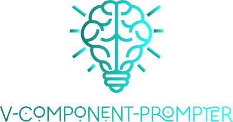

 <a href="./README.md">English</a> | 简体中文

为Vue开发中的一些导入的自定义组件带来 `props` 、 `emitEvents` 和 `expose methods` 提示。

## Example
- 我想要知道我导入的组件中有哪些 `props` 或者 `event` 可以传递和对应他们的类型

- 也许这个defineProps中的属性是从其他的 `ts` 文件中导出引入的

- 当你hover到这个组件的 `tagName` ,会有一个表格列出具体的可传递参数信息

- 当你hover到组件属性上的具体某一个属性时，会提示这个属性的类型，如果你在组件中存在注释，也会在hover的时候提示出来

## Supports
- vue2、vue3、vue(tsx)
- auto-import

## Auto Import

在最新版本中，我们可以检测“auto-imports.d.ts” 然后提供 `“props”`、`“events”`、`“methods”` 的智能提示

## :coffee:

[请我喝一杯咖啡](https://github.com/Simon-He95/sponsor)

## Sponsors

  

